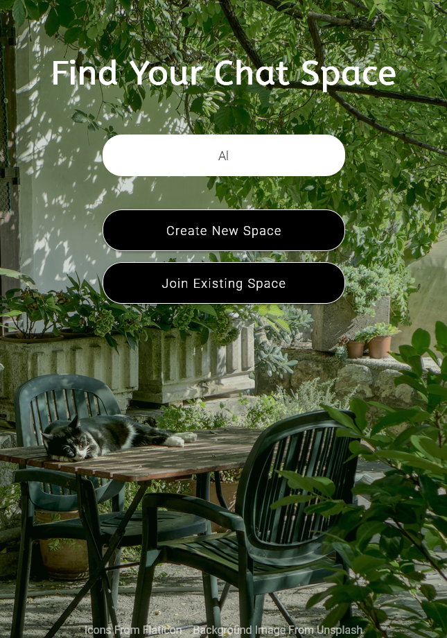
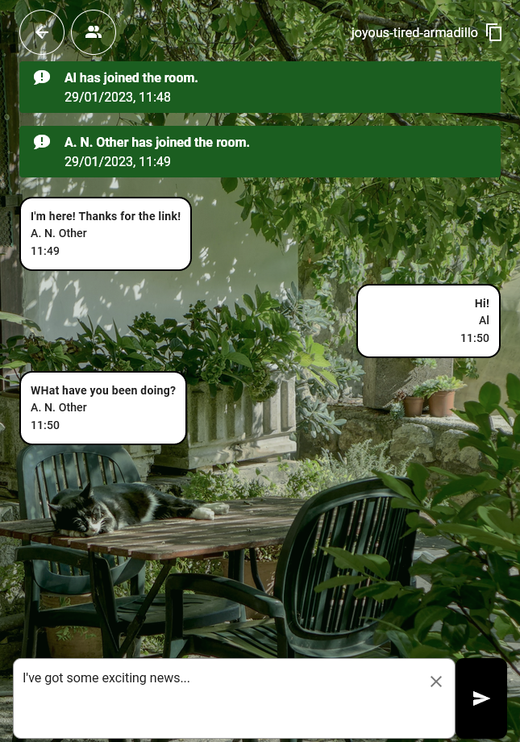

</img> 

## Project Overview

'Chat Space' is an instant messaging app with the ability to create and share dynamically created rooms.

Visit the deployed site here:
[https://chat-space-ae.netlify.app/](https://chat-space-ae.netlify.app/)

The site is built using Vue.js, and uses Socket.io to manage user connections.
  
</img>       </img>

